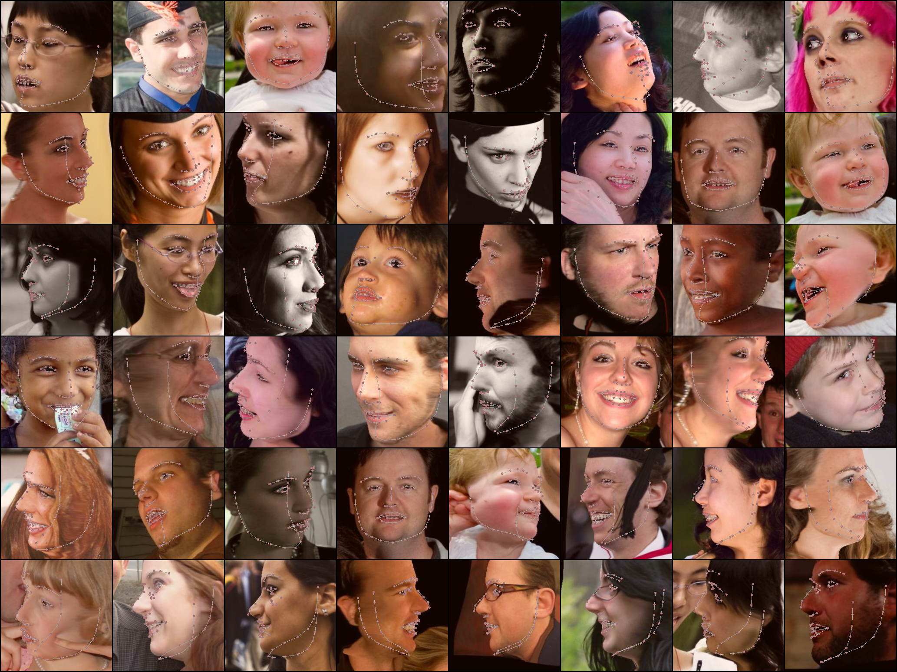

- You need install pytorch lightning


- You need 300W_LP dataset (copy all data to all folder )

## ① Pre-Requirements 

Before we start generat uv position map and train it. The first step is generate BFM.mat according to [Basel Face Model](https://faces.dmi.unibas.ch/bfm/).
For simplicity, The corresponding `BFM.mat` has been provided [here](https://drive.google.com/open?id=1Bl21HtvjHNFguEy_i1W5g0QOL8ybPzxw).

After download it successfully, you need to move `BFM.mat` to `utils/`.

Besides, the essential python packages were listed in `requirements.txt`.

## ② Generate uv_pos_map

[YadiraF/face3d](https://github.com/YadiraF/face3d) have provide scripts for generating uv_pos_map, here i wrap it for 
Batch processing.

You can use `DS_generator/generate_posmap_300WLP.py` as:

``` shell
cd DS_generator
python3 generate_posmap_300WLP.py

Then `300WLP_IBUG` dataset is the proper structure for training PRNet:

```

```
- 300WLP_IBUG
 - 0/
  - IBUG_image_xxx.npy
  - original.jpg (original RGB)
  - uv_posmap.jpg (corresponding UV Position Map)
 - 1/
 - **...**
 - 100/ 
```

Except from download from [`300WLP`](http://www.cbsr.ia.ac.cn/users/xiangyuzhu/projects/3DDFA/main.htm),
I provide processed *original--uv_posmap* pair of IBUG [here](https://drive.google.com/open?id=16zZdkRUNdj7pGmBpZIwQMA00qGHLLi94).

## ③ Training
After finish the above two step, you can train your own PRNet as:

``` shell

run_training.cmd
```

You can use tensorboard to visualize the intermediate output in `localhost:6006`:
```shell
run_tensorboard.cmd
```




